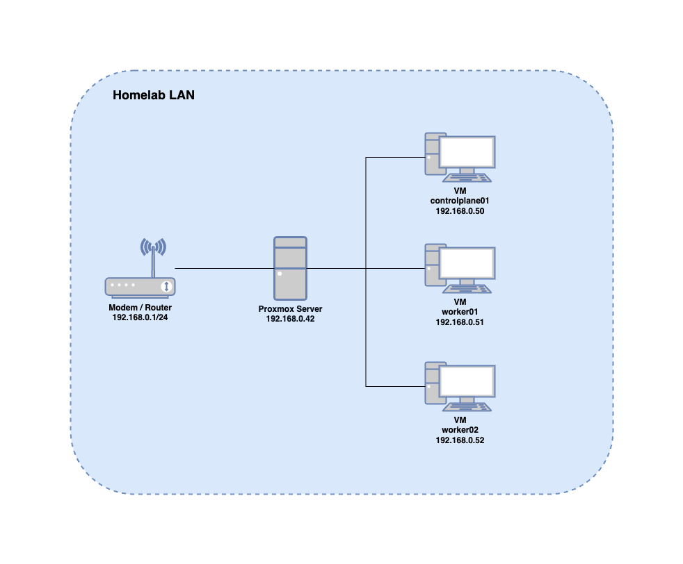

# Homelab

## Description

Files related to my mini homelab consisting of a Lenovo M900 Tiny (i5-6500T | 16GB RAM) running Proxmox.

3 VMs are currently provisioned. The 3 VMs forms a kubernetes cluster (1 control plane node and 2 worker nodes) administered using kubeadm.

## Technologies

List of some of the techonologies deployed to the cluster:

-   ArgoCD
-   MetalLB
-   NGINX Ingress Controller

## Network

