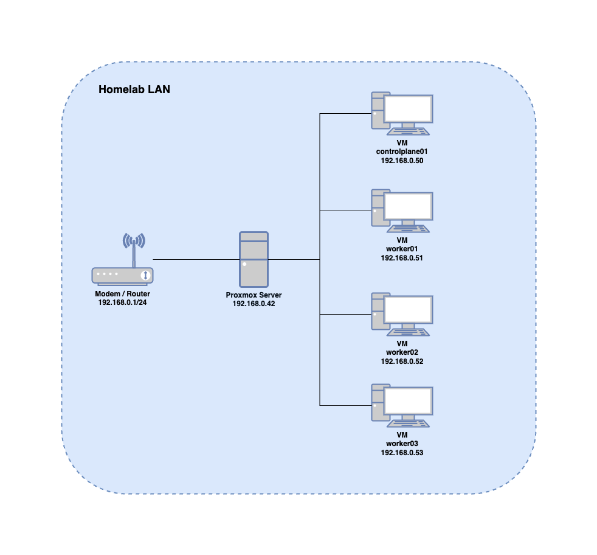

# Homelab

## Description

Files related to my mini homelab consisting of a Lenovo M900 Tiny (i5-6500T | 16GB RAM) running Proxmox.

3 VMs are currently provisioned. The 3 VMs forms a kubernetes cluster (1 control plane node and 2 worker nodes) administered using kubeadm.

## Technologies

List of some of the techonologies deployed to the cluster:

-   ArgoCD
-   MetalLB
-   NGINX Ingress Controller
-   Grafana + Prometheus

### ArgoCD

ArgoCD is used as GitOps CD tool in the cluster. The current workflow is to push manifests into `<PROJECT>/cluster/<APP_NAME>/` and then synchronize manually. ArgoCD will trigger reconciliation of desired cluster state vs actual cluster state upon sychronization.

### MetalLB

Since the cluster is running on bare-metal, the cluster won't have any access to load balancers provided by the various cloud platforms (AWS, GCP, Azure, etc.). No access to load balancers provided by cloud platforms results in services of type `LoadBalancer` to remain in `<pending>` state indefinitely due to not having an IP assigned. This leaves the option to use NodePorts to expose cluster externally, which can be cumbersome to work with. To solve this, MetalLB can be used as LoadBalancer implementation which integrates with standard network equipment, thus allowing to use a LoadBalancer on bare-metal clusters.

MetalLB is currently configured to have access to a static IP pool that it assign to services of type `LoadBalancer`. The IP pool is currently `192.168.0.100-192.168.0.200`, which limits the amount of services that can be exposed. The reduce the amount of IPs required, we can use an Ingress Controller.

### NGINX Ingress Controller

An Ingress Controller will act as a reverse proxy. It can manage egress and ingress of traffic from/to the cluster allowing for services to be access externally.
Using an Ingress Controller can reduce the amount of IPs required, since we only need to assign an IP to the controller, which then will manage the traffic.

The current deployed Ingress Controller is the NGINX Ingress Controller which deploys a pod (the controller) and a `LoadBalancer` service which MetalLB will assign an IP. All ingress to the cluster should be directed at the `LoadBalancer` service's assigned external IP address.

## Network

